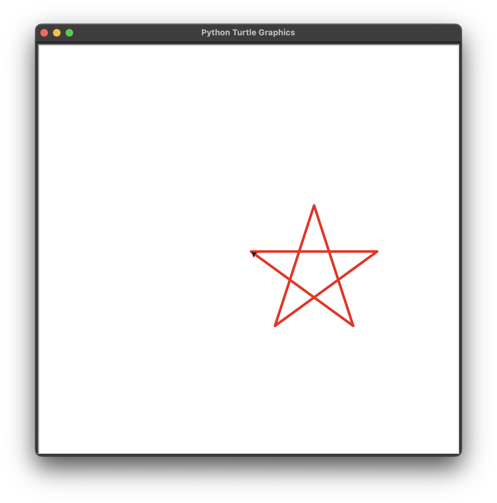

# 100 Days of Python

## Day 1

### 閱讀文章
- [01.初识Python.md](https://github.com/jackfrued/Python-100-Days/blob/master/Day01-15/01.初识Python.md)
- [學了 Python 能用來做什麼？| Medium](https://allaboutdataanalysis.medium.com/學了-python-能用來做什麼-3a5062113267)
- [Draw Rainbow using Turtle Graphics in Python - GeeksforGeeks](https://www.geeksforgeeks.org/draw-rainbow-using-turtle-graphics-in-python/)
- [4.8. A Few More turtle Methods and Observations — How to Think like a Computer Scientist: Interactive Edition](https://runestone.academy/ns/books/published/thinkcspy/PythonTurtle/AFewMoreturtleMethodsandObservations.html)

---

- Setup Github repository
- 設計人為吉多·范羅蘇姆（Guido van Rossum）
- 裝好了 Python 3.11
- 閱讀了 The Zen of Python （`import this`）
- Python 可以用來：
	- 網站後端
	- 自動化運維
	- DevOps
	- 爬蟲
	- 資料分析
	- 人工智慧
- 簡單小烏龜畫星星


## Day 2

### 閱讀文章
- [02.语言元素.md](https://github.com/jackfrued/Python-100-Days/blob/master/Day01-15/02.语言元素.md)
- [03.分支结构.md](https://github.com/jackfrued/Python-100-Days/blob/master/Day01-15/03.分支结构.md)
- [04.循环结构.md](https://github.com/jackfrued/Python-100-Days/blob/master/Day01-15/04.循环结构.md)
- [05.构造程序逻辑.md](https://github.com/jackfrued/Python-100-Days/blob/master/Day01-15/05.构造程序逻辑.md)
- [06.函数和模块的使用.md](https://github.com/jackfrued/Python-100-Days/blob/master/Day01-15/06.函数和模块的使用.md)

### 小練習
- Piece of Cake! | Kattis
- Cut the Negativity | Kattis

---

- 變數命名使用下底線分隔
- 轉換變數型態
	- `int()`
	- `float()`
	- `str()`
	- `chr()`
	- `ord()`
- 使用 `input()` 擷取輸入
- 格式化輸出 `print('%d + %d = %d' % (a, b, a + b))`
- 格式化輸出 `print(f'{f:.1f}華氏度 = {c:.1f}攝氏度')`
- 可以用反斜線拆行
  ```Python
  is_leap = year % 4 == 0 and year % 100 != 0 or \
          year % 400 == 0
	```
- 預設參數值
  ```Python
  def roll_dice(n=2):
    total = 0
    for i in range(n):
        total += randint(1, 6)
    return total
	```
- 不固定參數數量
  ```Python
  def sum(*args):
    total = 0
    for val in args:
        total += val
    return total
	```
- Main function
  ```Python
  if __name__ == '__main__':
	  print('Hello, world!')
	```

## Day 3

### 閱讀文章
- [07.字符串和常用数据结构.md](https://github.com/jackfrued/Python-100-Days/blob/master/Day01-15/07.字符串和常用数据结构.md)
- [08.面向对象编程基础.md](https://github.com/jackfrued/Python-100-Days/blob/master/Day01-15/08.面向对象编程基础.md)
- [09.面向对象进阶.md](https://github.com/jackfrued/Python-100-Days/blob/master/Day01-15/09.面向对象进阶.md)
- [[Python物件導向]淺談Python類別(Class)](https://www.learncodewithmike.com/2020/01/python-class.html)
- [Python OOP物件導向設計的類型方法(Instance, Class, Static Method) | by Sean Yeh | Python Everywhere -from Beginner to Advanced | Medium](https://medium.com/seaniap/python-oop物件導向設計的類型方法-instance-class-static-method-1ff71f50942d)

### 小練習
- 電子時鐘

---

- 容器
  ```Python
  list1 = [1, 2, 3]
  tuple1 = (1, 2, 3) // Immutable
  set1 = {1, 2, 3} // No repeat
  dict1 = {1: 'A', 2: 'B', 3: 'C'}
	```
- 物件：使用大駝峰命名
  ```Python
  class Student(object):

	__slots__ = ('_name', '_age', '__uid') // Restrict field

    def __init__(self, name, age, uid):
        self._name = name
        self._age = age
        self.__uid = uid // Private field

	@property // Getter
    def name(self):
        return self._name
        
    @property // Getter
    def age(self):
        return self._age
    
    @age.setter // Setter
    def age(self, age):
        self._age = age

    def study(self, course_name):
        print('%s is learing %s.' % (self._name, course_name))
	```
- 靜態方法
	```Python
  class Triangle(object):

    def __init__(self, a, b, c):
        self._a = a
        self._b = b
        self._c = c

    @staticmethod
    def is_valid(a, b, c):
        return a + b > c and b + c > a and a + c > b

  def main():
	print(Triangle.is_valid(3, 4, 5))
	```
- 類別方法
  ```Python
  from time import time, localtime
  
  class Clock(object):

    def __init__(self, hour=0, minute=0, second=0):
        self._hour = hour
        self._minute = minute
        self._second = second

    @classmethod
    def now(cls): // Use cls conventionally
        ctime = localtime(time())
        return cls(ctime.tm_hour, ctime.tm_min, ctime.tm_sec)

  def main():
	clock = Clock.now()
	```

## Day 4

### 閱讀文章
- [11.文件和异常.md](https://github.com/jackfrued/Python-100-Days/blob/master/Day01-15/11.文件和异常.md)
- [【Day 3】常見的資料格式 (2/3) - JSON - iT 邦幫忙](https://ithelp.ithome.com.tw/articles/10216970)

---

- 開啟檔案
  ```Python
  def main():
    with open('lorem.txt', 'r', encoding='utf-8') as file:
        for line in file:
            print(line)
            
    with open('lorem.txt', 'r', encoding='utf-8') as file:
        print(file.read())

  if __name__ == '__main__':
    main()
	```
- Exception
  ```Python
  def main():
    f = None
    try:
        f = open('lorem.txt', 'r', encoding='utf-8')
        print(f.read())
    except FileNotFoundError:
        print('File not found.')
    except LookupError:
        print('Unknown encoding.')
    except UnicodeDecodeError:
        print('Decode error.')
    finally:
        if f:
            f.close()
	```
- JSON 與 Python 對應
	- JSON, Python
	- Object, Dict
	- Array, List
	- String, str
	- Number, int...
	- true, True
	- null, None
- 讀寫 JSON
  ```Python
  import json

  def main():
      mydict = {
          'name': 'Eve',
          'age': 19,
          'friends': ['Alice', 'Bob'],
          'score': [
              {'subject': 'English', 'point': 80},
              {'subject': 'Chinese', 'point': 90},
              {'subject': 'Science', 'point': 85}
          ]
      }
      try:
          with open('data.json', 'w', encoding='utf-8') as file:
              json.dump(mydict, file)
      except IOError as e:
          print(e)
      print('Done')


  if __name__ == '__main__':
      main()
	```
- 其他 JSON 方法
	- `json.dump()`：物件寫入檔案
	- `json.load()`：檔案讀出物件
	- `json.dumps()`：物件變成字串
	- `json.loads()`：字串變成物件

## Day 5

### 閱讀文章
- [12.字符串和正则表达式.md](https://github.com/jackfrued/Python-100-Days/blob/master/Day01-15/12.字符串和正则表达式.md)
- [13.进程和线程.md](https://github.com/jackfrued/Python-100-Days/blob/master/Day01-15/13.进程和线程.md)

---

- 正則表達式
- Multiprocessing
- Multithreading